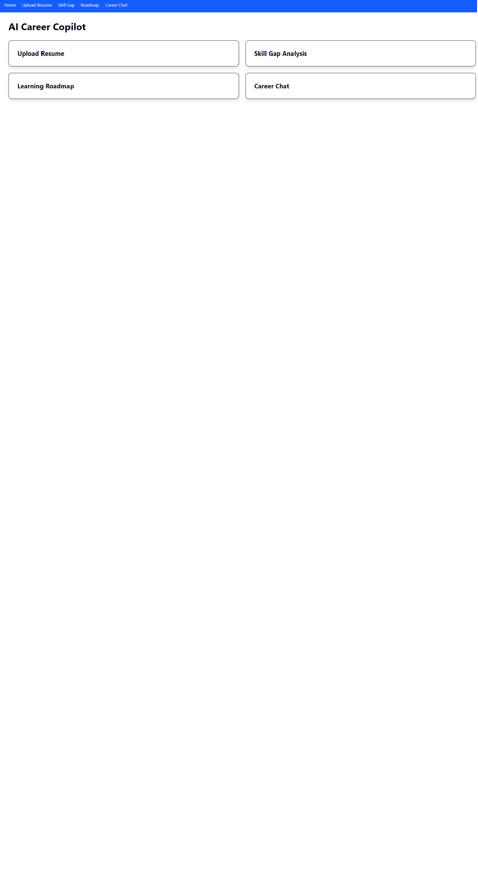
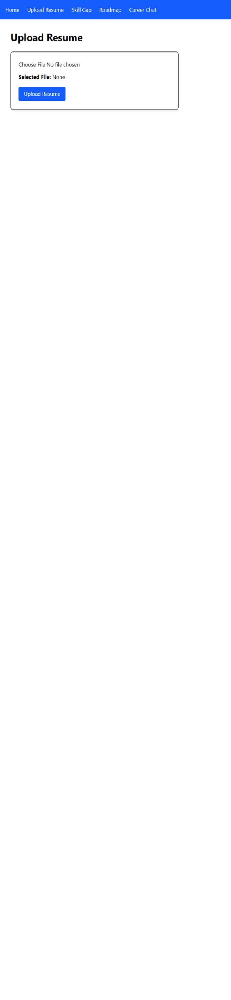
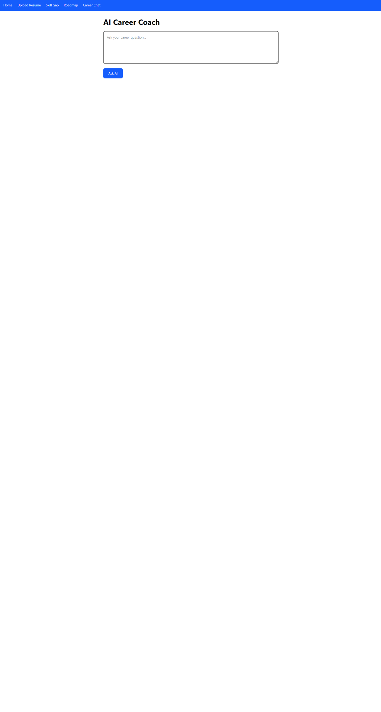

# AI Career Copilot 

An AI-powered career guidance platform that helps users analyze resumes, identify skill gaps, generate personalized learning roadmaps, and interact with an AI career coach.

## Features

### Resume Analysis

* Upload PDF resumes
* Extract skills and career information
* AI-powered resume evaluation using Gemini

### Skill Gap Analysis

* Compare current skills with target job roles
* Identify missing skills
* Personalized recommendations

### Learning Roadmap

* Generate structured learning plans
* Career-specific roadmaps
* AI-generated growth paths

### AI Career Coach

* Ask career-related questions
* Receive AI-powered guidance
* Personalized career recommendations

### Multi-Agent Workflow

* Resume Analysis Agent
* Skill Gap Agent
* Roadmap Agent
* Career Coach Agent
* Supervisor Agent using LangGraph

---

## Tech Stack

### Frontend

* React
* React Router
* Tailwind CSS
* Axios

### Backend

* FastAPI
* PostgreSQL
* SQLAlchemy
* Pydantic

### AI & LLM

* Google Gemini
* LangChain
* LangGraph
* FAISS Vector Database

---

## Project Structure

```text
career-copilot
│
├── backend
│   ├── app
│   ├── uploads
│   ├── knowledge_base
│   └── requirements.txt
│
├── frontend
│   ├── src
│   ├── public
│   └── package.json
│
├── screenshots
│
└── README.md
```

---

## Screenshots

### Home Dashboard



### Resume Upload



### Skill Gap Analysis


### Learning Roadmap


### AI Career Coach



---

## Installation

### Backend

```bash
cd backend

pip install -r requirements.txt

uvicorn app.main:app --reload
```

### Frontend

```bash
cd frontend

npm install

npm run dev
```

---

## Future Improvements

* User Authentication Dashboard
* Job Recommendation Engine
* Resume Scoring System
* Interview Preparation Module
* Deployment on Render/Vercel
* Real-Time AI Chat

---

## Resume Project Description

Built a full-stack AI-powered Career Copilot using FastAPI, React, PostgreSQL, Gemini AI, LangChain, LangGraph, and FAISS. Implemented resume analysis, skill-gap detection, learning roadmap generation, AI career coaching, and multi-agent workflows to provide personalized career guidance.
